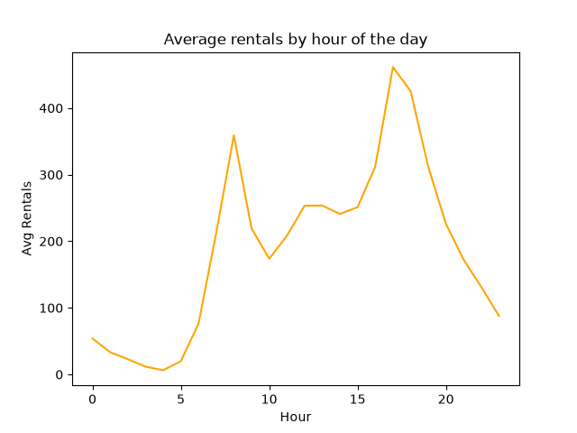
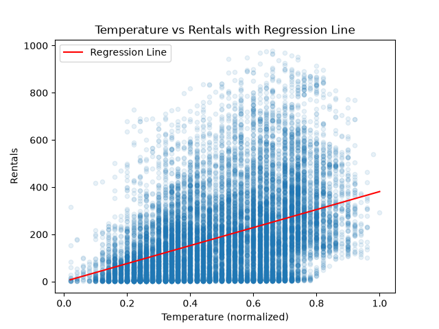
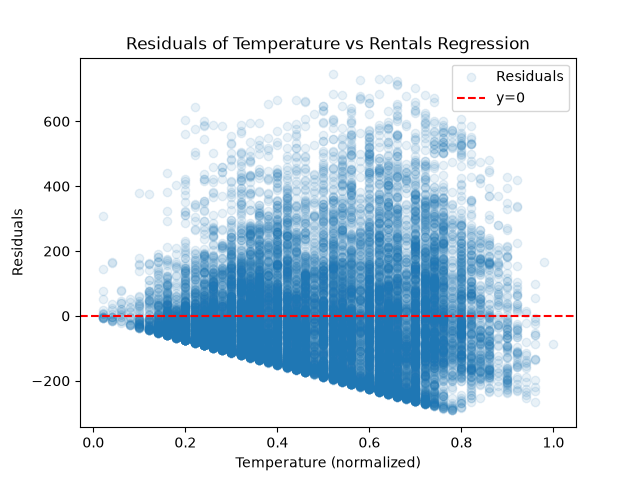

# Bike Rental Demand: A Regression Analysis

## Table of Contents
- [Overview](#overview)
- [Research Question](#research-question)
- [Data](#data)
- [Exploratory Analysis](#exploratory-analysis)
- [Simple Linear Regression](#simple-linear-regression)
- [Multiple Regression](#multiple-regression)
- [Evaluation](#evaluation)
- [Scenario Prediction](#scenario-prediction)
- [Limitations & Future Work](#limitations--future-work)
- [Conclusion](#conclusion)
- [Tools](#tools)

## Overview

This project tests whether weather conditions and time-of-day patterns can predict hourly bike rental demand, using Washington D.C.'s Capital Bikeshare dataset (17,379 hourly observations). It starts with a from-scratch simple linear regression on temperature, then builds a multiple regression model in `scikit-learn` using temperature, humidity, weather condition, time-of-day, and season together. The multiple regression model explains about 54% of the variance in hourly rentals (R² = 0.54) on held-out test data, evaluated on a genuine 80/20 train-test split. Applied to a specific test scenario (a cold, rainy winter evening rush hour), the model predicted around 37 rentals per hour, compared to a real observed average of about 118 for similar conditions. Weather and time-of-day factors are real, meaningful predictors of rental demand, but they do not tell the whole story.

## Research Question

Do weather conditions (temperature, humidity, weather situation) and time-of-day factors predict hourly bike rental demand?

## Data

- **Source**: [Bike Sharing Dataset](https://www.kaggle.com/datasets/lakshmi25npathi/bike-sharing-dataset) (Capital Bikeshare, Washington D.C.)
- **Size**: 17,379 hourly observations
- **Target**: `cnt`, total rentals per hour
- **Predictors**: `temp`, `hum`, `weathersit`, `hr` (bucketed into time-of-day categories), `season`

## Exploratory Analysis

Rentals peak sharply at 8am and 5pm, matching commute hours. Rentals also rise with temperature (r = 0.40), fall with humidity (r = -0.32), and are highest in clear weather and summer.

## Simple Linear Regression

A from-scratch regression (manually computed correlation, slope, intercept) using temperature as the predictor:

**r = 0.405, slope = 381.3, intercept = -0.04.** Each 1-unit increase in normalized temperature is associated with about 381 more rentals per hour.

The residual plot shows heteroscedasticity (wider spread at higher temperatures), indicating temperature alone leaves substantial variation unexplained.

## Multiple Regression

Built with `scikit-learn` using `temp`, `hum`, `weathersit`, `hr` (bucketed), and `season`. Hour was grouped into time-of-day categories (Night, Morning Rush, Midday, Evening Rush, Evening) rather than used as a raw number, since rentals spike twice a day rather than trending linearly. This also fixed a sign inconsistency where weather-condition coefficients had come out counterintuitively positive under the raw-hour version.

**Strongest effects**: `temp` (+305) and `hum` (−123). `Evening Rush` (+193) was the largest time-of-day effect. Weather conditions were all negative relative to clear skies, as expected.

## Evaluation

Trained on 80% of the data, tested on the held-out 20%:

**R² = 0.54.** The model explains about half the variance in hourly rentals.

## Scenario Prediction

For a cold, humid, rainy, winter evening rush hour, the model predicted about **37 rentals**, versus an actual average of about **118** for similar real conditions (n = 71 hours). This gap suggests the model's assumption that each factor acts independently misses how rush-hour demand is likely less weather-sensitive than midday demand, an interaction effect a purely additive linear model can't capture.

## Limitations & Future Work

- R² of 0.54 leaves about half the variance unexplained (events, real-time conditions, non-linearity)
- `season` and `temp` are correlated with each other, so their coefficients may partly overlap

## Conclusion

Weather and time-of-day factors do meaningfully predict bike rental demand, explaining about 54% of the variation in hourly rentals. That leaves roughly half the variation unexplained, and the scenario test showed the model's predictions can diverge notably from reality in specific cases, most likely because it treats each factor's effect as independent rather than interacting. So the answer to the research question is a qualified yes: these factors matter and provide real predictive power, but they are far from the whole story.

## Tools

Python, pandas, NumPy, Matplotlib, scikit-learn
